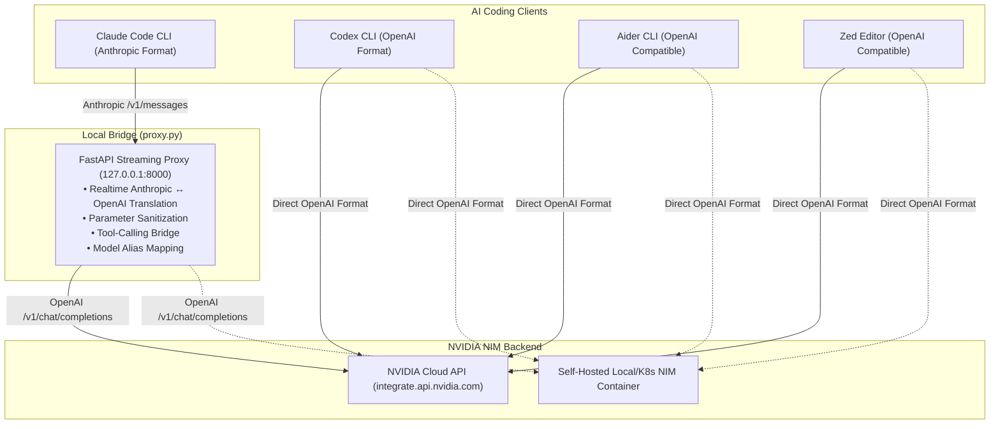

# 🚀 NIM Coding Assistants (Claude Code, Codex CLI, Aider & Zed Editor)

[]()
[]()
[]()
[]()

A lightweight, cross-platform bridge and launcher toolkit to run **Claude Code**, **Codex CLI**, **Aider**, and **Zed Editor** with **NVIDIA NIM** (NVIDIA Cloud API Catalog and self-hosted NIM microservices).

---

## 📌 Architecture Overview



---

## 🤖 Active Available Models

| Model ID | Provider | Tool Calling | Vision | Context Window | Best Used For |
| :--- | :---: | :---: | :---: | :---: | :--- |
| **`nvidia/nemotron-3-ultra-550b-a55b`** | NVIDIA | ✅ Yes | ❌ | 1,048,576 | **Recommended Default** — Ultra 550B flagship |
| `nvidia/nemotron-3-super-120b-a12b` | NVIDIA | ✅ Yes | ❌ | 1,048,576 | High-speed reasoning & agentic planning |
| `deepseek-ai/deepseek-v4-pro-0813` | DeepSeek | ✅ Yes | ❌ | 1,048,500 | Advanced coding & refactoring |
| `deepseek-ai/deepseek-v4-flash-0731`| DeepSeek | ✅ Yes | ❌ | 1,048,576 | Low-latency completions |
| `minimaxai/minimax-m3` | MiniMax | ✅ Yes | ✅ Yes | 524,288 | Multimodal vision & UI tasks |
| `z-ai/glm-5.2` | Z-AI | ✅ Yes | ❌ | 1,048,576 | General coding and reasoning |
| `thinkingmachines/inkling` | Thinking Machines | ✅ Yes | ✅ Yes | 131,072 | Interleaved reasoning, vision & tools |
| `moonshotai/kimi-k3` | Moonshot AI | ✅ Yes | ✅ Yes | 1,048,576 | Long-horizon reasoning, agentic coding & vision |

> 💡 *Need to add or modify models later? Check the [Adding Models Guide](docs/ADDING_MODELS.md).*

---

## ⚡ Quickstart

### 🍎 macOS & 🐧 Linux

#### 1. Clone & Setup
```bash
git clone https://github.com/hoshank/nim-coding-assistants.git
cd nim-coding-assistants

# Run foolproof setup wizard (creates .venv, configures .env & global launchers)
./setup.sh
```

> 💡 **Where is the configuration file?**
> - The template is provided as **`env.example`** (visible) and **`.env.example`**.
> - Running `./setup.sh` automatically creates `.env` and safely prompts for your NVIDIA API key.
> - To check system health anytime, run: `./setup.sh --doctor`

#### 2. Launch
```bash
# Launch Claude Code (uses Nemotron 3 Ultra 550B default via local bridge)
claude-nim

# Launch Codex CLI (connects directly to NVIDIA NIM)
codex-nim

# Launch Aider (Pair programmer with full 1M context & diff editing)
aider-nim

# Launch Aider in Architect Mode (Nemotron 3 Ultra plans, Super 120B edits)
aider-nim --architect

# Configure Zed Editor automatically
./scripts/mac-linux/setup-zed.sh
```

---

### 🪟 Windows (PowerShell or Command Prompt)

#### 1. Clone & Setup
Double-click `setup.bat` or run in PowerShell / Command Prompt:

```powershell
git clone https://github.com/hoshank/nim-coding-assistants.git
cd nim-coding-assistants

# Run Windows setup
.\setup.bat
```
*(Or in PowerShell: `powershell -ExecutionPolicy Bypass -File .\scripts\windows\install.ps1`)*

#### 2. Launch
Open a new terminal window:

```powershell
# Launch Claude Code
claude-nim

# Launch Codex CLI
codex-nim

# Launch Aider
aider-nim

# Launch Aider in Architect Mode
aider-nim --architect

# Configure Zed Editor automatically
powershell -ExecutionPolicy Bypass -File .\scripts\windows\setup-zed.ps1
```

---

## ⚡ Already Have Tools Installed? (Quick Configuration)

If you already have **Claude Code**, **Codex CLI**, **Aider**, or **Zed Editor** installed and just want to configure them to point to NVIDIA NIM without re-installing or overwriting custom configurations, check out:

👉 **[Guide: Configuring Existing Installations for NVIDIA NIM](docs/EXISTING_INSTALLATION.md)**

---

## 📖 In-Depth Guides

- ⚙️ **[Configuring Existing Installations](docs/EXISTING_INSTALLATION.md)**: Zero-fuss configuration for tools already installed on your system.
- 🤖 **[Aider Integration Guide](docs/AIDER.md)**: Pair programming with Architect mode, 1M context windows, and surgical diff editing.
- 🧩 **[Zed Editor Setup Guide](docs/ZED_SETUP.md)**: Full instructions for setting up Zed's Assistant panel, inline edit predictions, and setting your API key via `Cmd+Shift+P`.
- 🤖 **[Claude Code Integration Guide](docs/CLAUDE_CODE.md)**: Details on the Anthropic-to-OpenAI translation layer, parameter stripping (`output_config`, `context_management`), and subagent handling.
- 💻 **[Codex CLI Integration Guide](docs/CODEX_CLI.md)**: How to configure Codex CLI via `codex-nim` or `~/.codex/config.toml`.
- ➕ **[Adding & Updating Models Guide](docs/ADDING_MODELS.md)**: Step-by-step instructions to add newly released NIM models.

---

## ⚙️ CLI Cheat Sheet

### Claude Code (`claude-nim`)

By default, simply typing `claude-nim` launches Claude Code with **Nemotron 3 Ultra 550B** and automatically enables **`--dangerously-skip-permissions`** for fluid, uninterrupted agentic coding.

```bash
# 1. Default launch (Nemotron 3 Ultra 550B + auto-skip permissions)
claude-nim

# 2. Interactive model chooser
claude-nim --choose              # or -c

# 3. Model selection options
claude-nim --model nvidia/nemotron-3-super-120b-a12b
claude-nim -m deepseek-ai/deepseek-v4-pro-0813
claude-nim -m minimaxai/minimax-m3

# 4. Profile selection options (isolated ~/.claude-profiles/<name>)
claude-nim --profile dev        # or -P dev
claude-nim --profile vanilla    # clean, plugin-free profile

# 5. Combined Profile + Model + Reasoning Effort
claude-nim -P dev -m deepseek-ai/deepseek-v4-pro-0813 --effort high

# 6. Safety & Permission options
claude-nim --safe               # Disable auto-skip; require manual approvals for all actions

# 7. Non-interactive one-off prompt
claude-nim -p "Review this PR diff"

# 8. Proxy management
claude-nim --status             # Check proxy daemon health
claude-nim --logs               # View recent proxy logs
claude-nim --stop               # Stop proxy daemon
claude-nim --port 8088          # Run on custom proxy port
```

### Codex CLI (`codex-nim`)

```bash
# 1. Default launch (Nemotron 3 Ultra 550B)
codex-nim

# 2. Interactive model chooser
codex-nim --choose              # or -c

# 3. Model selection options
codex-nim --model nvidia/nemotron-3-super-120b-a12b
codex-nim -m deepseek-ai/deepseek-v4-pro-0813

# 4. Profile selection options (layers ~/.codex/<profile>.config.toml or built-ins)
codex-nim --profile danger-full-access    # or -p danger-full-access (bypasses sandbox & approvals)
codex-nim -p workspace-write              # Sandbox allows local workspace edits
codex-nim -p read-only                    # Safe read-only inspection

# 5. Combined Profile + Model + Effort
codex-nim -p danger-full-access -m deepseek-ai/deepseek-v4-pro-0813 -e high

# 6. Permission & Approval Bypass Shortcuts
codex-nim --dangerously-bypass-approvals-and-sandbox
codex-nim -a never

# 7. Custom or self-hosted endpoint
codex-nim --url http://localhost:8000/v1
```

### Aider (`aider-nim`)

```bash
# 1. Default launch (Nemotron 3 Ultra 550B + 1M token context window)
aider-nim

# 2. Interactive model & mode chooser (TUI dropdown)
aider-nim --choose              # or -c

# 3. Architect Mode (Nemotron 3 Ultra 550B plans, Super 120B applies diffs)
aider-nim --architect           # or -A

# 4. Model selection options
aider-nim --model nvidia/nemotron-3-super-120b-a12b
aider-nim -m deepseek-ai/deepseek-v4-pro-0813

# 5. Combined Architect + Custom Editor + Effort
aider-nim -A -m deepseek-ai/deepseek-v4-pro-0813 --editor-model deepseek-ai/deepseek-v4-flash-0731 -e high

# 6. Git commit behavior
aider-nim --no-auto-commits     # Keep edits unstaged for manual review
```

---

## 🌐 Self-Hosted NIM Deployment

If you are running your own local or Kubernetes NIM container (e.g. at `http://192.168.1.100:8000/v1`), configure `.env`:

```bash
NIM_BASE_URL="http://192.168.1.100:8000/v1"
NVIDIA_API_KEY="not-used"
NIM_MODEL="nvidia/nemotron-3-ultra-550b-a55b"
```

---

## ❓ Troubleshooting & FAQs

<details>
<summary><b>1. Port 8000 is already in use</b></summary>

Specify a different port using the `--port` flag:
```bash
claude-nim --port 8088
```
Or update `NIM_PROXY_PORT=8088` in `.env`.
</details>

<details>
<summary><b>2. Claude Code returns 400 Validation Error on unknown parameters</b></summary>

Claude Code sends Anthropic-specific internal parameters (`output_config`, `context_management`). The bridge proxy automatically strips these parameters before forwarding to NVIDIA NIM. Ensure your proxy is running via `claude-nim`.
</details>

<details>
<summary><b>3. Claude Code returns 404 Model Not Found for Haiku or Sonnet</b></summary>

Claude Code internally queries aliases (`haiku`, `sonnet`, `opus`) for background tasks. The `claude-nim` launcher maps all alias variables (`ANTHROPIC_DEFAULT_HAIKU_MODEL`, etc.) to your selected NIM model to prevent 404 errors.
</details>

<details>
<summary><b>4. Windows: PowerShell script execution disabled</b></summary>

If PowerShell displays an execution policy error, run with `-ExecutionPolicy Bypass`:
```powershell
powershell -ExecutionPolicy Bypass -File .\scripts\windows\install.ps1
```
</details>

<details>
<summary><b>5. Claude Code tool call parsing error / API failure</b></summary>

If Claude Code fails with `"The model's tool call could not be parsed (retry also failed)"`, ensure you are running `claude-nim` with the latest `proxy.py`. The bridge proxy includes a dedicated Anthropic SSE streaming engine that translates OpenAI reasoning deltas (`reasoning_content` -> `thinking_delta`) and tool calls (`tool_calls` -> `input_json_delta`), cleanly transitioning blocks and preventing dropped tool events.
</details>

---

## 🛠️ Prerequisites
- Python 3.10+
- [Claude Code CLI](https://docs.anthropic.com/en/docs/agents-and-tools/claude-code/overview) (`npm install -g @anthropic-ai/claude-code`)
- [Codex CLI](https://github.com/openai/codex) (optional)
- [Aider](https://aider.chat/) (`uv tool install --python 3.12 aider-chat` or `pip install aider-chat`) (optional)
- [Zed Editor](https://zed.dev/) (optional)
- NVIDIA API Key from [build.nvidia.com](https://build.nvidia.com/)
