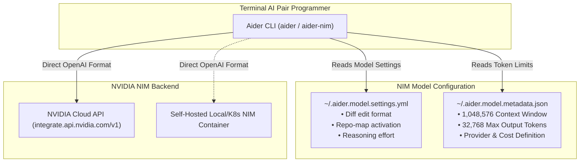

# 🤖 Aider with NVIDIA NIM Setup Guide

This guide explains how to use **Aider** (AI pair programming in your terminal) with **NVIDIA NIM** models.

---

## 📌 Architecture Overview

Aider utilizes [LiteLLM](https://github.com/BerriAI/litellm) for LLM routing and supports OpenAI-compatible endpoints directly.



---

## 🖥️ Interactive TUI Workflow

When you type `aider-nim` without flags in an interactive terminal, it presents a 4-step arrow-key dropdown menu:

1. **Step 1: Select Model** — Choose between Nemotron 3 Ultra 550B (default), Super 120B, DeepSeek v4 Pro, DeepSeek v4 Flash, MiniMax M3, GLM-5.2, or Inkling.
2. **Step 2: Select Workflow Mode**:
   - **Architect Mode (Recommended)**: Dual-model setup where Nemotron 3 Ultra 550B acts as the architect/planner and Nemotron 3 Super 120B acts as the editor applying surgical SEARCH/REPLACE diffs.
   - **Standard Pair Programming (Diff Format)**: Single model applying diff blocks directly to your code.
   - **Whole File Editing**: Single model rewriting whole files.
3. **Step 3: Select Reasoning Effort** — `medium` (default), `high`, or `low`.
4. **Step 4: Git Auto-Commit Behavior**:
   - **Auto-commit edits (Recommended)**: Automatically commits each successful AI edit with descriptive commit message.
   - **Manual git commits (`--no-auto-commits`)**: Leaves modified files unstaged for manual review.

To bypass the interactive menu and launch immediately with defaults, pass `-y` / `--yes` / `--quick`.

---

## 🚀 Quickstart

### macOS & Linux

```bash
# 1. Default launch (Interactive dropdown menu; defaults to Nemotron 3 Ultra 550B)
aider-nim

# 2. Quick launch with defaults (skips interactive menu)
aider-nim -y                   # or --yes, --quick

# 3. Architect Mode (Dual-model pair programming)
aider-nim --architect          # or -A

# 4. Interactive model chooser
aider-nim --choose             # or -c

# 5. Model selection
aider-nim --model deepseek-ai/deepseek-v4-pro-0813
aider-nim -m nvidia/nemotron-3-super-120b-a12b

# 6. Reasoning Effort
aider-nim -m deepseek-ai/deepseek-v4-pro-0813 -e high

# 7. Git commit controls
aider-nim --no-auto-commits    # Keep files unstaged
```

### Windows (PowerShell)

```powershell
# 1. Default launch
aider-nim

# 2. Quick launch
aider-nim -y

# 3. Architect Mode
aider-nim --architect

# 4. Model selection
aider-nim -m deepseek-ai/deepseek-v4-pro-0813
```

---

## 🏛️ Architect Mode Explained

Architect mode (`--architect` or `-A`) is one of Aider's most powerful features:
- **The Architect**: A massive-scale reasoning model (by default **NVIDIA Nemotron 3 Ultra 550B**) analyzes your codebase, reviews the repo map, explores dependencies, and formulates the implementation plan and pseudo-code.
- **The Editor**: A high-efficiency coding model (by default **NVIDIA Nemotron 3 Super 120B**) translates the architect's plan into precise SEARCH/REPLACE diff blocks and applies them to your files.

This dual-model workflow dramatically reduces latency, eliminates syntax errors, and maximizes reasoning quality on complex codebases.

To specify a custom editor model:
```bash
aider-nim --architect --model deepseek-ai/deepseek-v4-pro-0813 --editor-model deepseek-ai/deepseek-v4-flash-0731
```

---

## ⚙️ Running Standard `aider` Directly

If you prefer using the standard `aider` command directly instead of the `aider-nim` launcher:

### 1. Automatic Global Setup
Run the setup script:
```bash
./scripts/mac-linux/setup-aider.sh
```
This automatically configures `~/.aider.conf.yml`, `~/.aider.model.settings.yml`, and `~/.aider.model.metadata.json`.

### 2. Manual Configuration
Add the following to `~/.aider.conf.yml` or your repo root's `.aider.conf.yml`:

```yaml
model: openai/nvidia/nemotron-3-ultra-550b-a55b
openai-api-base: https://integrate.api.nvidia.com/v1
model-settings-file: ~/.aider.model.settings.yml
model-metadata-file: ~/.aider.model.metadata.json
show-model-warnings: false
stream: true
```

And export your API key in your shell profile (`~/.zshrc` or `~/.bashrc`):
```bash
export NVIDIA_API_KEY="nvapi-your-key-here"
export OPENAI_API_KEY="$NVIDIA_API_KEY"
export OPENAI_API_BASE="https://integrate.api.nvidia.com/v1"
```

Then simply run:
```bash
aider
```

---

## 🧠 Model Metadata & 1M Context Window

NVIDIA NIM models feature massive context windows (e.g. 1,048,576 tokens). By default, if Aider encounters an unrecognized model name, it falls back to restrictive token budgets (such as 4,096 tokens) and prompts you with a warning.

The included `config/aider.model.metadata.json` and `config/aider.model.settings.yml` ensure that:
1. **Full 1M Token Context**: Aider allocates up to 1,048,576 tokens for repository context and 32,768 output tokens.
2. **Repo-Map Optimization**: Aider builds an accurate AST repo-map sized optimally for large-context models (up to 4,096 map tokens).
3. **Diff Edit Format**: Aider applies surgical `diff` SEARCH/REPLACE blocks instead of rewriting entire files.
4. **No Warning Prompts**: Model window warnings and documentation prompts are cleanly disabled.

---

## 🌐 Self-Hosted NIM Deployment

To point Aider to a self-hosted NIM microservice running locally or on Kubernetes:

```bash
aider-nim --url http://192.168.1.100:8000/v1 --model nvidia/nemotron-3-ultra-550b-a55b
```

Or configure in `.env`:
```bash
NIM_BASE_URL="http://192.168.1.100:8000/v1"
NVIDIA_API_KEY="not-used"
NIM_MODEL="nvidia/nemotron-3-ultra-550b-a55b"
```

---

## ❓ Troubleshooting & FAQs

<details>
<summary><b>1. Aider warns about unknown context window or prompts about documentation URL</b></summary>

Aider shows this prompt when `--model-metadata-file` is missing. When using `aider-nim`, this file is injected automatically. For standard `aider`, ensure `~/.aider.conf.yml` points to `~/.aider.model.metadata.json` or pass `--no-show-model-warnings`.
</details>

<details>
<summary><b>2. Aider rewrites whole files instead of outputting diffs</b></summary>

Without custom model settings, Aider defaults unknown models to `whole` format. When using `aider-nim`, `edit_format: diff` is automatically applied from `config/aider.model.settings.yml`. You can also manually pass `--edit-format diff`.
</details>

<details>
<summary><b>3. How do I disable automatic Git commits?</b></summary>

Launch with:
```bash
aider-nim --no-auto-commits
```
Or in `~/.aider.conf.yml`, set:
```yaml
auto-commits: false
```
</details>
