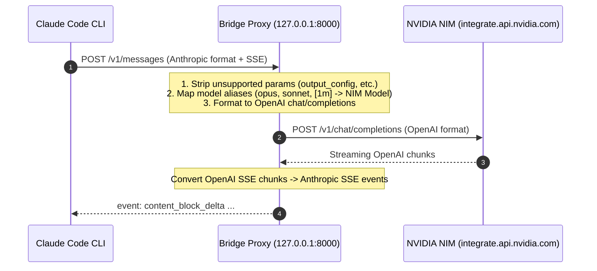

# 🤖 Claude Code with NVIDIA NIM Deep Dive

This document explains how **Claude Code** interacts with **NVIDIA NIM** through the translation bridge proxy.

---

## 🏗️ How the Bridge Works



---

## ⚡ Environment Variables Configured by `claude-nim`

When you launch `claude-nim`, the launcher sets the required environment variables:

```bash
export ANTHROPIC_BASE_URL="http://127.0.0.1:8000"
export ANTHROPIC_API_KEY="not-used"
export MODEL_NAME="nvidia/nemotron-3-ultra-550b-a55b"
export ANTHROPIC_CUSTOM_MODEL_OPTION="nvidia/nemotron-3-ultra-550b-a55b"
export ANTHROPIC_DEFAULT_HAIKU_MODEL="nvidia/nemotron-3-ultra-550b-a55b"
export ANTHROPIC_DEFAULT_SONNET_MODEL="nvidia/nemotron-3-ultra-550b-a55b"
export ANTHROPIC_DEFAULT_OPUS_MODEL="nvidia/nemotron-3-ultra-550b-a55b"
export CLAUDE_CODE_SUBAGENT_MODEL="nvidia/nemotron-3-ultra-550b-a55b"
```

### Why Override Aliases (`HAIKU`, `SONNET`, `OPUS`, `SUBAGENT`)?
Claude Code uses internal aliases for background tasks and subagents. If these are not redirected to your active NIM model, Claude Code will attempt to query Anthropic's cloud for `claude-haiku-...` resulting in `404 Not Found` errors.

---

## 🛡️ Parameter Sanitization & Protocol Translation

Claude Code v2.1+ sends Anthropic-specific beta headers and payload keys such as:
- `output_config`
- `context_management`
- `anthropic_beta`
- `beta`

NVIDIA NIM's OpenAI validation layer rejects unexpected parameters with `HTTP 400 Validation Error`. The bridge proxy automatically strips these parameters before forwarding while preserving streaming SSE and tool-calling structures.

### 🔄 Streaming Tool-Calling & Anthropic SSE Translation
Claude Code strictly parses Server-Sent Events (SSE) according to Anthropic's Messages specification. Standard third-party proxies often drop tool-call deltas or stream invalid thinking blocks, leading to `The model's tool call could not be parsed` errors.

The bridge proxy in `proxy.py` solves this with a custom streaming SSE translator:
- **Thinking / Reasoning Blocks**: NVIDIA NIM models returning reasoning tokens (`reasoning_content`) are translated into valid Anthropic `thinking` blocks (`content_block_start` with `type: "thinking"` followed by `thinking_delta`).
- **Tool Use Blocks**: When tool calls are triggered, the proxy cleanly closes any active text or thinking block (`content_block_stop`), emits `content_block_start` with `type: "tool_use"`, streams arguments chunk-by-chunk using `input_json_delta`, and finalizes the block.
- **Stop Reason Resolution**: Sets `stop_reason: "tool_use"` when tool calls are generated, allowing Claude Code to execute tools (such as Bash, Read, Write, Edit) without parse failures.
- **Name Restoration**: Re-maps truncated tool names (>64 characters) back to their original names.

---

## 🖥️ Interactive TUI Workflow

When you type `claude-nim` without flags in an interactive terminal, it presents a 4-step arrow-key dropdown menu:
1. **Step 1: Select Model** — Choose between Nemotron 3 Ultra 550B (default), Super 120B, DeepSeek v4 Pro, DeepSeek v4 Flash, MiniMax M3, GLM-5.2, or Inkling.
2. **Step 2: Select Profile** — Default (`~/.claude`), Clean Vanilla (`~/.claude-profiles/vanilla`), or Dev (`~/.claude-profiles/dev`).
3. **Step 3: Select Reasoning Effort** — `medium` (default), `high`, or `low`.
4. **Step 4: Permissions Mode** — `--dangerously-skip-permissions` (default for seamless coding) or Standard Prompts (`--safe`).

To bypass the interactive menu and launch immediately, pass flags (e.g. `-m <model>`) or use `-y` / `--yes`.

---

## 🚀 CLI Commands & Options

By default, typing `claude-nim` starts Claude Code with **Nemotron 3 Ultra 550B** and **`--dangerously-skip-permissions`** enabled automatically.

```bash
# Default launch (interactive dropdown menu if run in terminal; defaults to Nemotron 3 Ultra + skip-permissions)
claude-nim

# Quick launch (bypass interactive menu with defaults)
claude-nim -y                    # or --yes, --quick

# Interactive model selector only
claude-nim --choose              # or -c

# Launch with specific models
claude-nim --model deepseek-ai/deepseek-v4-pro
claude-nim -m minimaxai/minimax-m3
claude-nim -m nvidia/nemotron-3-super-120b-a12b

# Launch with specific profile
claude-nim --profile dev        # or -P dev

# Combined model + profile + effort
claude-nim -P dev -m deepseek-ai/deepseek-v4-pro -e high

# Run in safe mode (disables auto-skip permissions; manual confirmations)
claude-nim --safe

# Run a non-interactive one-off prompt
claude-nim -p "Explain the main function in src/main.rs"

# Background proxy management
claude-nim --status
claude-nim --logs
claude-nim --stop
```

---

## 🎭 Profiles & Plugin Isolation

Claude Code manages its settings, credentials, MCP servers, and installed plugins within its config directory. By leveraging `--profile <name>`, `claude-nim` points `CLAUDE_CONFIG_DIR` to an isolated profile folder (`~/.claude-profiles/<name>`).

### 1. Pure Vanilla Instance
To launch a completely clean, plugin-free Claude session:
```bash
claude-nim --profile vanilla
```
In this session, no plugins or custom extensions are loaded.

### 2. Dedicated Plugin Profiles
To maintain profiles with specific plugins or MCP integrations:
```bash
# Launch a dedicated profile (e.g. dev)
claude-nim --profile dev

# Inside this session, install plugins as needed:
# /plugin install <plugin-name>
```
All installed plugins and configurations are saved only to `~/.claude-profiles/dev/`, keeping your default and `vanilla` profiles completely untouched.

