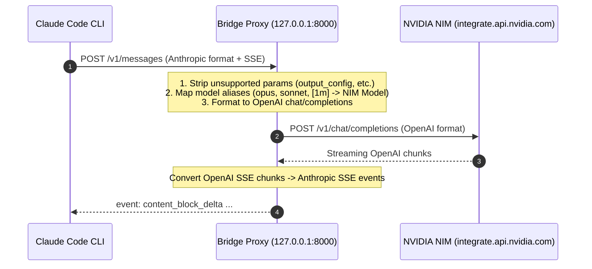

# 🤖 Claude Code with NVIDIA NIM Deep Dive

This document explains how **Claude Code** interacts with **NVIDIA NIM** through the translation bridge proxy.

---

## 🏗️ How the Bridge Works



---

## ⚡ Environment Variables Configured by `claude-nim`

When you launch `claude-nim`, the launcher sets the required environment variables:

```bash
export ANTHROPIC_BASE_URL="http://127.0.0.1:8000"
export ANTHROPIC_API_KEY="not-used"
export MODEL_NAME="nvidia/nemotron-3-ultra-550b-a55b"
export ANTHROPIC_CUSTOM_MODEL_OPTION="nvidia/nemotron-3-ultra-550b-a55b"
export ANTHROPIC_DEFAULT_HAIKU_MODEL="nvidia/nemotron-3-ultra-550b-a55b"
export ANTHROPIC_DEFAULT_SONNET_MODEL="nvidia/nemotron-3-ultra-550b-a55b"
export ANTHROPIC_DEFAULT_OPUS_MODEL="nvidia/nemotron-3-ultra-550b-a55b"
export CLAUDE_CODE_SUBAGENT_MODEL="nvidia/nemotron-3-ultra-550b-a55b"
```

### Why Override Aliases (`HAIKU`, `SONNET`, `OPUS`, `SUBAGENT`)?
Claude Code uses internal aliases for background tasks and subagents. If these are not redirected to your active NIM model, Claude Code will attempt to query Anthropic's cloud for `claude-haiku-...` resulting in `404 Not Found` errors.

---

## 🛡️ Parameter Sanitization

Claude Code v2.1+ sends Anthropic beta headers and payload keys such as:
- `output_config`
- `context_management`
- `anthropic_beta`
- `beta`

NVIDIA NIM's OpenAI validation layer rejects unexpected parameters with `HTTP 400 Validation Error`. The bridge proxy automatically strips these parameters before forwarding while preserving streaming SSE and tool-calling structures.

---

## 🚀 CLI Commands & Options

```bash
# Start Claude Code with the default model (Nemotron 3 Ultra 550B)
claude-nim

# Launch with another active model
claude-nim --model deepseek-ai/deepseek-v4-pro
claude-nim --model minimaxai/minimax-m3

# Run a non-interactive one-off prompt
claude-nim -p "Explain the main function in src/main.rs"

# Check background proxy status
claude-nim --status

# View live proxy logs
claude-nim --logs

# Stop the background proxy
claude-nim --stop
```
